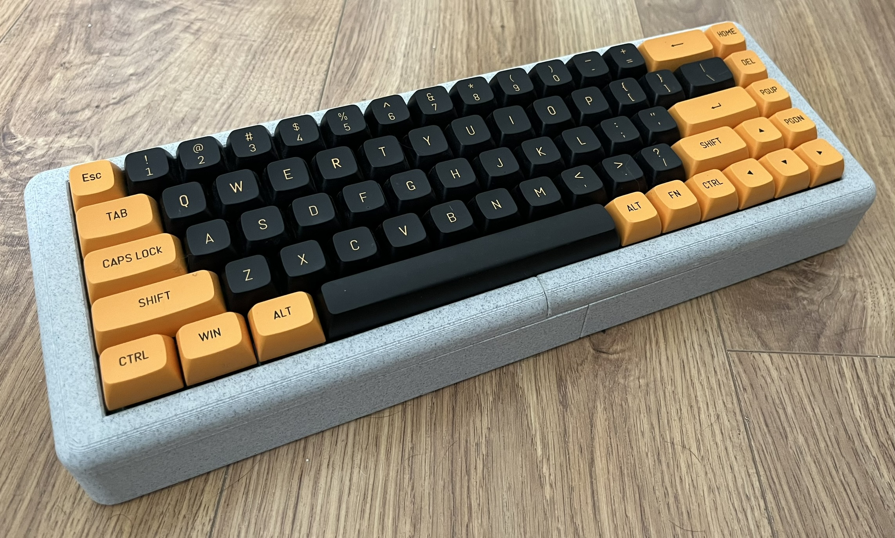
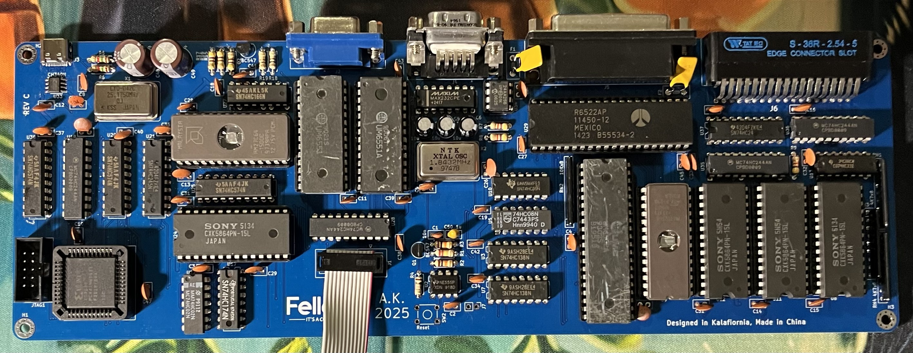

# FellaPC

All-in-keyboard 6502 based PC with built-in BASIC interpreter.

Features:

- BASIC interpreter,
- 6502/65C02/W65C02S CPU @1.8432 MHz,
- 32 KiB of ROM, 24 KiB of static RAM,
- 640x480@60Hz VGA adapter with character generator (80x60 black and white text mode only),
- 6522 VIA for onboard control, I2C memory and user port,
- 2 UARTs (USB-C and RS-232),
- 69% mechanical keyboard,
- edge connector expansion port,
- powered via USB-C port.




## Memory map

[Memory map](memmap.md)

## BASIC

FellaPC provides BASIC language subset (partially inspired by C64 BASIC).

### Program editing

Simple line editor is provided, code is entered line by line. To insert a new line or
overwrite existing line type in the line number followed by the code.

Example

```
10 FOR I = 0 TO 10
20 PRINT I
30 NEXT I
```

Let's say we want to change line number 20 to print a square of I insted. To do this
simply type in a new version of this line:

```
20 PRINT I*I
```

The program will be updated:

```
LIST

10 FOR I = 0 TO 10
20 PRINT I*I
30 NEXT I

Ready
```

### Commands

Following commands are supported:

#### PRINT

Print out to the screen.

Syntax examples:

```
PRINT "String"
PRINT "String", variable
PRINT "String"; variable
PRINT variable
PRINT var1, var2
```

#### INPUT

Prompt user for input, real numbers only.

Syntax examples:

```
INPUT var
INPUT "Prompt", var
```

#### FOR, TO, STEP, NEXT

Used for loops. Intelacing and infinite loop nesting are supported.

Syntax example:

```
10 FOR VAR=0 TO 10 STEP 2
20 PRINT I
30 NEXT I
```

Above loop will output:

```
0
2
4
6
8
```

#### GOTO

Jump to the line in the code.

Syntax example:

```
10 GOTO 30
20 PRINT "foo"
30 PRINT "bar"
```

Above code will output only `bar`, as `foo` has been skipped by `goto`.

#### GOSUB, RETURN

Similar to GOTO, but allows returning back from the destination of jump via `RETURN`.
Return address (line after `GOSUB`) is placed on the return stack. There is no limit
on the stack depth (apart from the computer memory capacity).

Syntax example:

```
10 GOSUB 200
20 PRINT "bar"
30 END
200 PRINT "foo"
210 RETURN
```

Folowing code will output:

```
foo
bar
```

#### IF, THEN, ELSE

Conditional execution.

Syntax example:

```
var = 5
10 IF var > 10 THEN 100 ELSE 200
100 PRINT "foo"
200 PRINT "bar"
```

Above code will only output `bar`, as var is not greater than 10.

#### CLEAR

Clear the screen and return cursor to the home position.

#### END

End program execution, return the interactive mode.

#### RUN

Starts execution of the program. Can be used in the interactive mode only.

#### LIST

Displays program. Can be used in the interactive mode only.

#### SAVE

Stores the program on the non-volatile memory. Can be used in the interactive mode only.

#### LOAD

Loads the program from the non-volatile memory. Can be used in the interactive mode only.

#### ABS()

Return absolute value.

Syntax example:

```
10 PRINT ABS(-5)
20 PRINT ABS(5)
```

This program will output:

```
5
5
```

#### FRE

Pseudo-variable. Return available BASIC memory in bytes.

#### INT()

Returns integer part of the real number.

Syntax example

```
PRINT INT(3.1412)
```

Will output `3`.

#### RND

Pseudo-variable. Return a random real number in the range of <0, 1).

#### PEEK(), POKE()

Functions that allow direct reading and modification of the computer memory.

Syntax examples:

```
PRINT PEEK(100)
```

Displays value of the memory at address 100.

```
POKE(100, 42)
```

Stores 42 at the address 100.

#### Operators

Following operators are supported:

```
( ) * + , - / ; < = > <= >= AND NOT OR
```

#### Variables

Variables are declared on the first use:

```
a = 5
var = 42
```

## Limitations

Applies to rev A, rev B:

All limitations in the firmware come from the limited size of the ROM space and
poor performance of the CC65 C compiler. 16 KB of program memory was thought to be
just enought to fit a full BASIC interpreter implementation. Alas, CC65 does not optimize
almost at all for the code size. 6502 is also infamous of not playing nice with the
C language. There was much struggle at the end of the development with the ROM space
running out - so some features were removed or abandoned and some functions has been
rewritten in assembled instead (which provides huge savings). It was deciced against
writing the BASIC interpreter itself in the assembler, in hope to reuse it in the future
project, with its portability in mind. Writing the whole firmware in assembler would also
prolong the project and more it difficult to maintain.

Due to above concerns, following hardware features are not handled by the firmware:

- both UARTs,
- 6522 VIA (apart from I2C and VGA ROM selection),
- interrupts (only NMI/VBLANK is handled).

Although these features can still be used by PEEK and POKE keywords of BASIC.

Visual glitches are expected on the VGA output when the VRAM is being modified. CPU is
too slow and DRAM refresh takes too long to be able to perfom any operation during
VBLANK.

## PCB

FellaPC rev C SBC PCB and keyboard PCB are a 2-layer design.


## Case

Case is provided as STL files that are designed for the FDM 3D priting. There are
three parts:

- keyboard,
- main body,
- bottom panel.

All parts are too big to be printed in one piece on most 3D printers, so cutting
the model during slicing and glueing back together after printing might be needed.
Threaded inserts have to be embedded in the plastic.

Hardware needed:

- threaded inserts:
 - M3 4x5 mm 9 pieces,
 - M3 4x4 mm 4 pieces,
- bolts:
 - M3x4 or M3x5 for keyboard and SCB 8 pieces,
 - M3x25 for main body 5 pieces.

